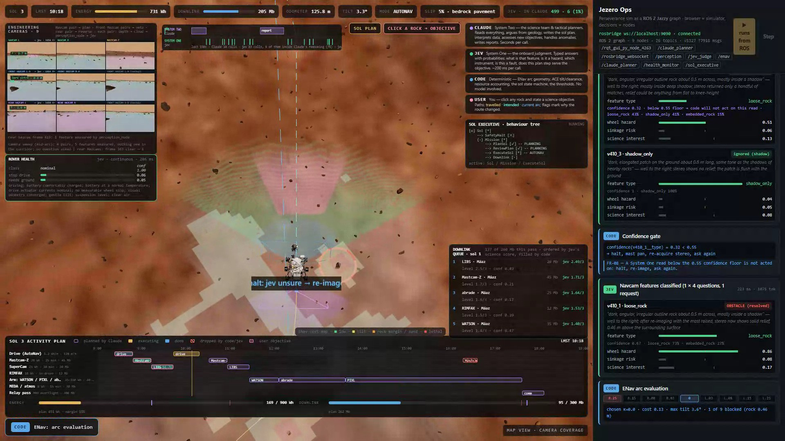
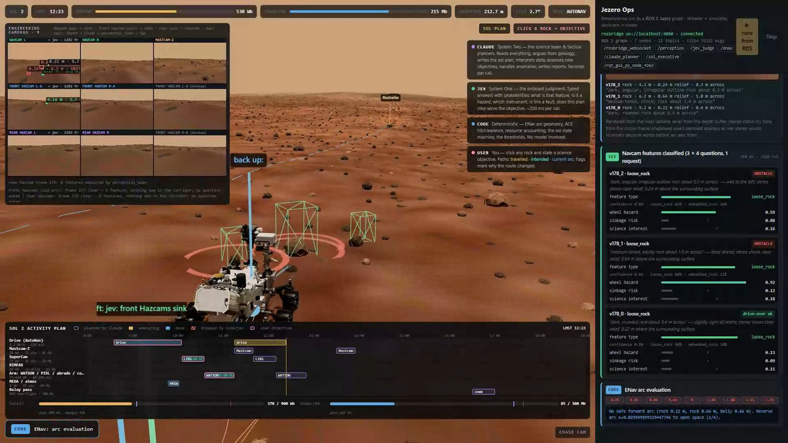
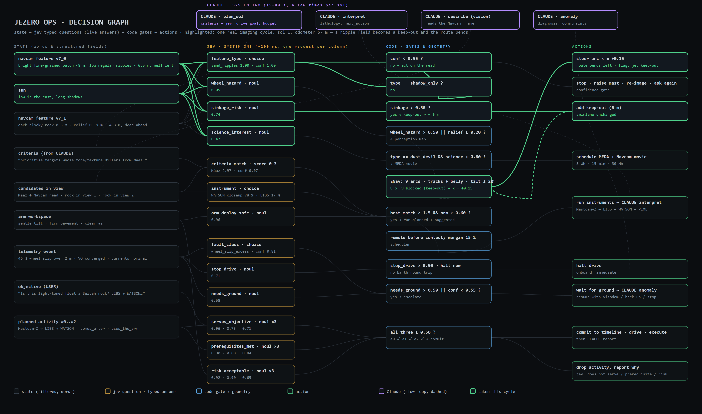

# Jezero Ops

**This is a demo. It is not flight software, it is not a research result, and nothing here has been validated against a real rover.** It is a toy built to make one idea visible: that a robot's decisions split into two kinds, and that you can use two very different models for the two kinds and watch the seam between them.

A simulated Perseverance drives itself across real USGS Jezero Crater terrain. It sees rocks with cameras, decides what is a hazard, plans science, puts an arm on a rock, and reports back. Three different things make those decisions, and every decision on screen is labelled with which one made it.

[](docs/jezero-ops-demo-720p.mp4)

**[▶ Watch the run (120 s)](docs/jezero-ops-demo-720p.mp4)** — a full three-sol run, re-timed. The moments where a decision changes something play at real time; the waiting in between is compressed, with the multiplier shown in the corner throughout.

---

## System One and System Two

The framing comes from Daniel Kahneman's *Thinking, Fast and Slow* (2011), which popularised a distinction psychologists had drawn for decades. Kahneman describes two modes of thought:

**System 1** is fast, automatic and effortless. It runs constantly, it has no sense of having worked, and it answers whether you asked it to or not: recognising a face, hearing hostility in a voice, knowing that 2 + 2 is 4. It is not a lesser kind of thinking — it is what expertise feels like from the inside. Its characteristic failure is confident error, answering an easier question than the one you asked without telling you it has done so.

**System 2** is slow, deliberate and effortful: argument, arithmetic, weighing evidence, holding several things in mind at once. It is expensive, it tires, and it is lazy — it mostly endorses whatever System 1 hands it.

Kahneman's two systems describe one mind, not an engineering diagram, and he was careful to call them useful fictions rather than parts you could point at in a brain. This project takes the fiction literally, because in software you actually can build the two parts separately:

| | System 2 here | System 1 here |
|---|---|---|
| **Played by** | Claude, a large language model | jev, TypeSafe's System One model |
| **Asked** | open questions with no fixed answer set | narrow questions with a fixed answer set |
| **Returns** | an argument, in language, against a schema | a probability distribution over the options, with a confidence |
| **Takes** | 15 to 80 seconds | about 250 ms |
| **Called** | a few times per sol | hundreds of times per sol |

The engineering claim is narrower than the psychology, and it is this: **an LLM is the wrong shape for a decision that has to happen a hundred times a minute and produce a number you can threshold.** Ask an LLM whether something is a hazard and you get prose. You can force JSON out of it, but the confidence it reports is not calibrated and the latency is three orders of magnitude too high. A System One model is the opposite: it cannot plan, argue or write, and does not try. You hand it structured state and typed questions, and it returns a full distribution in one fast call.

So the rover gets both, plus a third thing that is neither:

| | Role | How it is called | Speed |
|---|---|---|---|
| **jev** (System 1) | Onboard judgment. Is that a rock or a shadow, will it break a wheel, is this telemetry a fault, does this activity serve the objective | `POST /v1/systemone`, every question for a decision point in one request | ~250 ms |
| **Claude** (System 2) | The science team. Reads the downlink, argues from geology, writes the sol plan, interprets data, handles anomalies | `claude -p --json-schema` via the local CLI | 15 to 80 s |
| **Code** | Arc geometry, tilt and clearance, keep-outs, energy and data budgets, the state machine, every threshold | `public/enav.js`, `ros2/.../geometry.py` | instant |

The rule throughout: **code owns the workflow, models answer narrow questions.** jev is never asked what to do next. Claude is never asked to classify a blob or pick a steering arc. Geometry is never a judgment call.

One more thing worth borrowing from Kahneman: System 2's job is to monitor System 1 and override it when it is confidently wrong. Here that job belongs to code, not to Claude, and it is a single rule — if jev's confidence in what it is looking at falls below 0.55, nothing acts on the answer. The rover stops, raises the mast, takes a second stereo pair and asks again. That gate fires several times in the recorded run, and watching it fire is the most interesting thing in the video.

---

## Quick setup

You need **Node 20+**, **Chrome**, a **TypeSafe API key**, and the **Claude Code CLI** logged in.

```bash
git clone https://github.com/Devonance/rover-claude-jev-demo.git
cd rover-claude-jev-demo
npm install

cp .env.example .env          # then put your TypeSafe key in it

npm install -g @anthropic-ai/claude-code
claude                        # log in once, then exit

npm start
```

Open <http://localhost:4180> and press **Autoplay**.

A full run takes about 20 minutes and costs roughly **$1.10 in Claude usage and $0.03 in jev**. You can click any rock in the scene and type a science objective in your own words.

```bash
npm run smoke      # load the page headless, report console errors
npm run autorun    # headless full run, screenshots to shots/
```

### Optional: the ROS 2 version

The same decision graph also runs as ROS 2 Jazzy nodes under WSL 2, with the browser as the simulator over rosbridge. This is what the video was recorded from.

```bash
ros2/setup_wsl.sh      # provision
ros2/start_graph.sh    # launch, then open http://localhost:4180/ros.html
```

Node table and run recipe: [`docs/ros2-migration.md`](docs/ros2-migration.md).

---

## What happens in a run

1. **Plan.** Claude reads the downlink and writes the sol plan against a JSON schema: targets, instruments, a drive goal, a budget, and a plain-language criteria string handed to jev for onboard target selection.
2. **Drive.** Code plans nine candidate steering arcs each cycle. Before any wheel is committed, and again half way along the arc, **every camera pair images at once** and everything new in the corridor goes to jev in a single request. Any one pair can veto the move.
3. **Gate.** Code turns jev's probabilities into actions. A rock over the wheel-hazard threshold enters the obstacle map; sand with sinkage risk becomes a keep-out; confidence under 0.55 and code refuses to act at all.
4. **Science.** Claude reads the Navcam frame. jev scores the visible candidates against Claude's criteria and picks the instrument. Code enforces ordering, the arm collision model, and budget margin. Claude interprets the result.
5. **Health.** jev reads **every telemetry sample**, about one a second: battery, thermal, actuator currents, slip, visual odometry, tilt, suspension, dust, and which way each is trending. It triages what it sees, and if Earth is needed, Claude diagnoses.

## How the rover sees

jev is text-only by design, so nothing reaches it as pixels.

1. Each camera renders a colour frame and a depth frame, standing in for its stereo pair.
2. Depth is unprojected into world points and relief above local ground is measured.
3. Connected blobs of relief become features with the numbers a stereo pipeline produces: distance, bearing, footprint, max relief, tone against the ground, outline, shadow fraction.
4. Those numbers are bucketed into **words**. 0.42 m becomes "knee-height". 4.3 m becomes "a few metres ahead".
5. The words go to jev as structured state with typed questions attached; probabilities come back.

Stereo fails in deep shadow, and it fails in *patches* rather than pixel by pixel, so the model does too. That is what makes "rock or shadow?" an honest question rather than a lookup.



## What the rover has actually looked at

Every camera's depth frame is splatted onto the ground as a coverage map. The occlusion is exact, because the map is built from what the depth buffer recorded: a rock does not merely block the view, it *is* what the camera saw, so the ground behind it is never marked as seen. Each group has its own colour — green Navcam, blue front Hazcam, violet rear, magenta Mastcam-Z — and everywhere the rig has had a clear line stays marked behind the rover.

## The decision graph



Every place jev is asked something, what it is asked, and what code does with the answer. The lit path is one real cycle: a bright ripple field scores 0.74 sinkage risk, code adds a 6 m keep-out, 8 of 9 arcs are blocked, the route bends.

Claude built this graph, and then got it back as a tool. `tools/mcp_jev_server.mjs` exposes `ask_jev(state, questions)` over MCP, so Claude can consult System One mid-reasoning — score candidates against its own draft criteria, check an ordering, break a tie — and treat the answers as evidence rather than commands. [`docs/decision-graph-2.png`](docs/decision-graph-2.png) traces what it asked and what it did with the answers.

---

## Limitations, measured

Everything below is measured against the world's rock list, which the rover never sees. The tools are in `tools/` and you can re-run them.

**Small rocks are missed, and get driven over.** (`tools/perception_eval.mjs`, `tools/traverse_eval.mjs`)

| rock diameter | found |
|---|---|
| 0.8–1.2 m | 56% |
| 0.5–0.8 m | 20% |
| 0.35–0.5 m | 7% |

On a 60 m straight traverse, six rocks above the 0.20 m step limit ended up under a wheel; the perception map had two of them and had never seen the other four. The honest statement is: **the rover drives over roughly ten step-limit rocks per 100 m, and most of those it never saw.** Large rocks at close range are now found reliably — 8/8 at 4 m, 8/8 at 7 m, 7/8 at 10 m (`tools/recall_probe.mjs`) — which was not true before; a bug in the shadow-dropout model was tearing shadowed boulders into fragments and reporting them as flat dark patches. Median size error on what it does find is 47%.

**The arm's reach is short and its turret is wide.** Measured off the model (`tools/arm_metrics.mjs`): the instrument reaches 2.05 m from a shoulder 0.83 m up, and the turret on the end is a disc **0.83 × 0.34 × 0.84 m** with the instrument on its rim, 0.37 m from the turret's own pivot. That geometry rules out most placements. `tools/arm_collision_eval.mjs` puts the rover at a stand-off from ten large rocks and tries three faces on each:

| stand-off | placements accepted | top-facet placements | arm inside the rock |
|---|---|---|---|
| 1.2 m | 1/24 | 1/10 | 0 |
| **1.6 m** | **20/30** | **10/10** | **0** |
| 2.0 m | 9/30 | 1/10 | 0 |
| 2.3 m | 10/30 | 0/10 | 0 |

The science stand-off is 1.6 m for that reason. An earlier version modelled the turret as a capsule of radius 0.12 m — a sevenfold under-estimate — which is why it could be buried in a boulder while reporting clearance. It is now sampled off the real turret meshes, and rocks are ellipsoids sized to the measured footprint and height rather than spheres. **Two thirds of candidate placements are rejected**, which is the honest consequence of a turret that wide.

**Other limitations, stated plainly:**

- Instruments return one-paragraph summaries from a truth table, not simulated spectra.
- The dust devil and the slip event are scripted so a short run exercises those paths. Rocks, sand and shadows are perceived.
- Perception uses the renderer's depth buffer as a stereo stand-in, with deliberate patchy dropout in shadow. Real stereo is noisier everywhere.
- jev's calibration is taken from its documentation and our own spot checks. Nothing here was validated on rover data.
- The back-up-and-drive-around manoeuvre exists and fires when every forward arc is blocked, but it is rare enough in a recorded run to be easy to miss. It is not showcased well.
- The arm's collision model is sampled points and capsules against ellipsoids. Much better than a guess, still not the real turret geometry against the real rock mesh.
- Claude's tactical plans are good geology but occasionally over-plan a sol; the scheduler drops what does not fit.

None of these are limits of the architecture. They are a perception pipeline that needs to be denser, a turret that needs a real collision mesh, and a demo that needs more takes.

---

## Layout

```
server/          HTTP server and the two model proxies
server/jev.mjs         the System One question sets
server/prompts.mjs     the System Two prompts and schemas
public/          three.js scene, ENav, vision, coverage map, sol state machine, ops console
ros2/            jezero_msgs + jezero_ops, the ROS 2 port
tools/           terrain build, recording, the measurement suite, MCP jev server
docs/            reports, figures, decision graphs
```

**The measurement suite.** Start the server first, then:

```bash
node tools/perception_eval.mjs       # recall and box quality vs the world rock list
node tools/recall_probe.mjs          # close-range recall on the biggest rocks
node tools/traverse_eval.mjs         # rocks driven over per 100 m
node tools/coverage_eval.mjs         # does a rock actually occlude the coverage map
node tools/arm_metrics.mjs           # measure the arm envelope off the model
node tools/arm_collision_eval.mjs    # does the arm ever end up inside a rock
```

**Recording and cutting the video:**

```bash
node tools/autorun_ros.mjs shots/run --record out/run.webm
node tools/make_segments.mjs shots/run/events.json out/segments.json 110
blender -b --python tools/encode_ramp.py -- out/run.webm out/run.mp4 out/segments.json 1920 1080
```

## Reading

- [`docs/jezero-ops-report.md`](docs/jezero-ops-report.md) — how the three engines work together and what was measured ([PDF](docs/jezero-ops-report.pdf), [LaTeX](docs/jezero-ops-report.tex))
- [`docs/vision-paper.md`](docs/vision-paper.md) — "Two Speeds of Mind", the theory behind the split
- [`docs/ros2-migration.md`](docs/ros2-migration.md) — the ROS 2 port
- [`CLAUDE.md`](CLAUDE.md) — working notes for Claude Code in this repo

## Sources

Terrain: USGS Astrogeology, Mars 2020 TRN CTX DTM and orthomosaic, Fergason et al. 2020, doi:10.5066/P906QQT8. Rover: NASA/JPL-Caltech Perseverance 3D model. Rock scans: Poly Haven (CC0). Rock distribution: Golombek size-frequency model. Procedures follow published JPL AutoNav, ENav/ACE and AEGIS descriptions. The System 1 / System 2 framing follows Daniel Kahneman, *Thinking, Fast and Slow* (Farrar, Straus and Giroux, 2011).
