# Jezero Ops — splitting a rover's mind between a System One and a System Two

*Kevin Horton · September 2026 · built in one session with Claude Code, TypeSafe's jev, three.js, Blender, and real NASA/USGS data*

> **This is a demo.** Not flight software, not a research result, and not validated against any real rover. It exists to make one idea visible: that a robot’s decisions split into two kinds, and that two very different models can take the two kinds.

**Video:** <https://youtu.be/X4679Fy1Epc> (120 s, re-timed; see §5a.5)
**Code:** <https://github.com/Devonance/rover-claude-jev-demo>

---

## 1. The idea in one paragraph

A Mars rover has two kinds of thinking to do. Slow, deliberate, argued-from-evidence thinking: *what should this sol accomplish, what do these spectra mean, is this objective worth the energy?* And fast, narrow, high-frequency judgment: *is that dark thing a rock or a shadow, will this patch swallow a wheel, does this plan step actually serve the objective, should we stop?* JPL splits these between a ground team and onboard flight software. We split them between two very different AI systems and made the split visible on screen: **Claude** (a large language model) plays the science team and tactical planners; **jev** (TypeSafe's System One model) plays the onboard judgment, returning typed answers with calibrated probabilities in ~200 ms; and **plain code** owns everything that should never be a judgment call — geometry, budgets, thresholds, the state machine. Every decision in the video is colour-coded by which of the three made it. By the fifth pass the graph is flight-like — Claude calls are ROS 2 actions with feedback and cancel, the executive is a behaviour tree, jev watches the telemetry stream — and the rover has a real arm: a kinematic chain driven by inverse kinematics, placed on a spot jev chose and cleared for contact by jev from the hover.

## 2. Why two models and not one

The obvious build is "put an LLM in the loop for everything." It fails in two directions at once. An LLM is too slow and too expensive to answer *is that a rock?* every few metres, and — more importantly — it is not designed to give a *calibrated probability*: ask it whether something is a hazard and you get prose, not a number you can threshold. A System One model like jev is the opposite: it does not reason, plan, or generate text at all. You hand it structured state and a set of narrow typed questions (a **Choice** over options, a yes/no **Noul**, a **Score** on ordered levels) and it returns a full probability distribution over the answers in one fast call, with a confidence you can gate on. That is precisely the shape of an onboard decision. It is also precisely *not* the shape of "write me a sol plan."

So the architecture follows the TypeSafe rule — *code owns the workflow, the model answers narrow typed questions* — twice over, at two speeds:

| | CLAUDE (System Two) | JEV (System One) | CODE |
|---|---|---|---|
| **Role** | science team + rover planners | onboard judgment | flight rules, geometry, budgets |
| **Input** | everything: downlink, targets, hypotheses, history, Navcam frames | a filtered JSON state + typed questions | numbers |
| **Output** | a structured plan / interpretation / report (JSON schema) | probabilities per option, plus confidence | deterministic |
| **Latency** | 15–80 s | 200–300 ms | µs |
| **Called** | a few times per sol | at every decision point | continuously |
| **Never asked to** | pick an arc, classify a blob | plan, reason, generate text, do arithmetic | judge anything semantic |

## 2a. Built twice: browser first, then ROS 2

The first build was a web page — HTML and CSS for the HUD, swimlane and console, three.js for terrain and rover, a Node server holding the two model calls. Every decision path was designed and recorded there. It was then moved onto ROS 2 (see the ROS 2 section): the same page kept only what a simulator owns and talks to a graph of five nodes over rosbridge. The port changed no rule and no question, only where they live. Every screenshot below is from the ROS 2 run — hence the live "ROS 2 graph" panel and the nine-camera rig in the corners.

## 3. What the system actually does

### 3.1 The world

- **Terrain** — the USGS *Mars 2020 Terrain Relative Navigation CTX DTM Mosaic* (20 m/px) and its 6 m/px orthomosaic, cropped to 1.28 km around 18.4385°N 77.4335°E: the Máaz / Séítah / Artuby-ridge area Perseverance worked in its first year. The real 46 m of relief drives the rover's pitch and roll and ENav's tilt checks.
- **Rover** — the NASA/JPL-Caltech Perseverance 3D model, wheels separated in Blender so they roll, mast and arm animated.
- **Synthetic, and labelled as such** — rover-scale micro-relief (fractal noise), a rock field from the Golombek cumulative-fractional-area model (k = 0.07, ≈55 000 rocks ≥ 0.35 m in the central box; each rock is one of 14 CC0 photogrammetry scans from Poly Haven, decimated to ~160 triangles, instanced and tinted to the Máaz/Séítah tones), a few ripple fields, and four scripted events so the run exercises every decision path.
- **Targets** carry real names and simplified "truth tables" from published results: Máaz (basalt), Yeehgo, Rochette (the first cored rock; sulfate-filled fractures), Bastide at the Séítah contact (olivine cumulate altered to carbonate).

### 3.2 The sol loop (JPL procedure, encoded)

1. **Assess downlink** → 2. **choose science that discriminates between hypotheses** → 3. **sequence** remote sensing before contact science, abrade before PIXL/SHERLOC, core last → 4. **respect the envelope** (900 Wh, 300 Mb, 420 min, 200 m) with 15 % margin → 5. **uplink**. Claude is given this as its procedure and returns a plan against a JSON schema: prioritised targets with instrument activities and rationale, a drive goal with constraints for the onboard system, a budget, and — importantly — a plain-language **criteria** string that is handed to jev for onboard target selection. The plan is laid on a **swimlane** (one lane per subsystem, with each instrument's Wh/min/Mb) and executed by code, block by block.

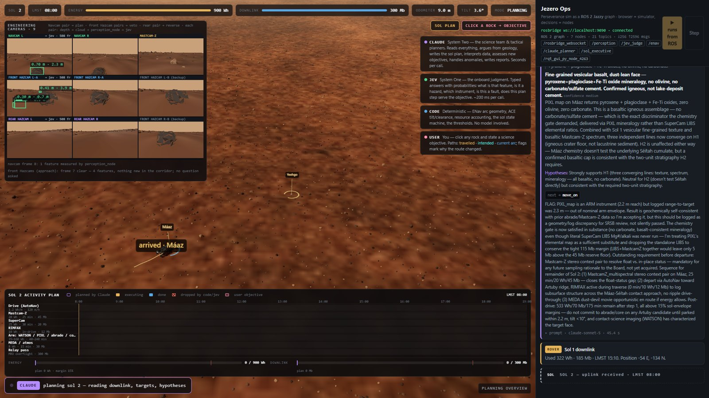

*Sol 2 planning, ROS 2 run. Top: the HUD. Top left: the nine-camera rig, idle at the parked rover. Bottom: the swimlane — one lane per subsystem, each instrument's Wh / minutes / Mb, blocks coloured by state, cumulative energy and data against the 15 % margin. Right: the console, every entry badged with its engine — Claude's PIXL interpretation from sol 1, the sol 1 downlink, the sol 2 uplink — under the live graph panel (7 nodes, 21 topics, message counters).*

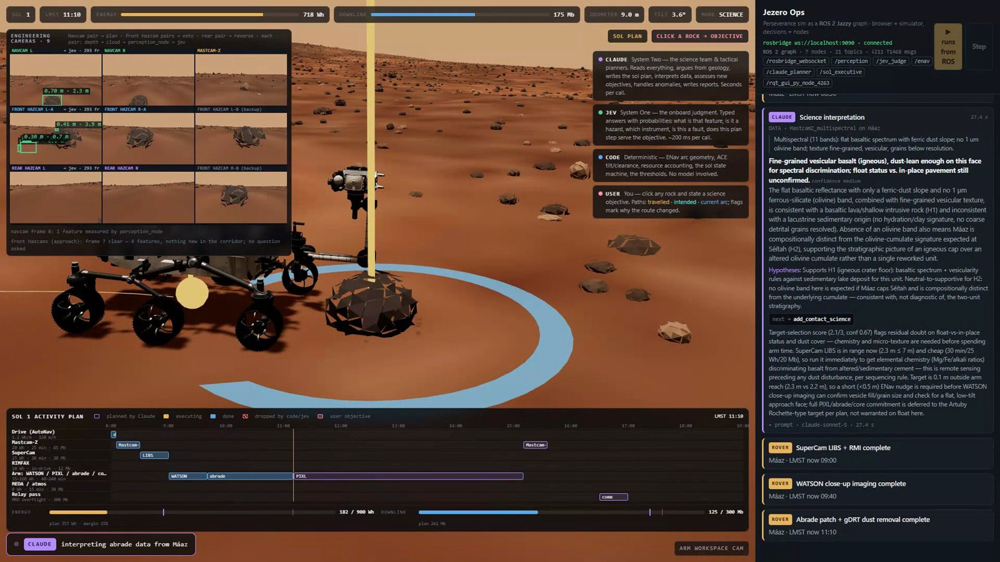

*Contact science at Máaz, sol 1, arm-workspace camera (ROS 2 run). The rig shows the Navcam pair with the target boxed at 2.3 m and the front Hazcams measuring two cobbles in the arm workspace. Right: Claude's Mastcam-Z interpretation (fine-grained vesicular basalt; float status unconfirmed) and next action — LIBS first, then a short nudge into arm reach for WATSON; WATSON → abrade → PIXL on the swimlane.*

### 3.3 Driving: perception → jev → ENav

*Figure 1. The rover's decision graph in the style of TypeSafe's own demos. Left: the filtered state jev is shown (words, not raw numbers). Middle: jev's typed questions with their live answers — a Choice returns an option and a confidence, a Noul a probability, a Score a position on ordered levels. Right of that: the code gates that turn those numbers into actions, and the actions themselves. Claude's slow loop runs across the top and touches the graph only at its edges: it writes the criteria the middle column applies, and it reads the results. The lit path is a real cycle from the recorded run: a bright ripple field → `sand_ripples` 1.00 / `sinkage_risk` 0.74 → keep-out 6 m → ENav finds 8 of 9 arcs blocked and steers κ = +0.15.*

This is the part that changed most during the day, and it is the part worth explaining to anyone building with these tools.

*First version:* the "Navcam" was a list lookup — rocks within a cone ahead were pulled from the world's rock table and described in words. It worked, but it was hard-coded knowledge dressed up as perception.

*Final version:* the rover **sees**. A camera rides the mast; each imaging cycle it renders a colour frame and a depth frame (standing in for the stereo range map). Depth is unprojected to world points, relief above the local ground is measured, and connected blobs become features with the numbers a real stereo pipeline produces: distance, bearing, extent, maximum relief, tone relative to the ground, outline (fill ratio), and how much of the blob is in shadow. Shadowed pixels are sampled sparsely, because real stereo fails in deep shadow — which is exactly what makes "rock or shadow?" a genuine question.

Then the discipline that makes jev useful: **numbers become words before jev sees them.** *"medium-toned, blocky rock about 0.3 m across, casting a long shadow; stereo shows clear relief, 0.19 m above the surrounding surface; a few metres ahead, slightly left of centre."* jev is text-only by design (its docs are explicit: pre-process images into text or structured fields), and it is bad at arithmetic, so code does the measuring and jev does the judging. Four questions per feature, all in one request:

- `feature_type` — Choice: embedded rock / loose rock / bedrock slab / sand ripples / shadow only / dust devil
- `wheel_hazard` — Noul: would a wheel over it risk damage or high-centring?
- `sinkage_risk` — Noul: loose fine-grained material?
- `science_interest` — Noul: worth an opportunistic observation?

Code then applies rules: a rock jev calls a wheel hazard, or that stereo measured above the 0.20 m step limit, goes into the **perception map**; a ripple field with `sinkage_risk > 0.5` becomes a 6 m keep-out; a `shadow_only` blob is ignored (geometry alone would have stopped for it); a `dust_devil` with `science_interest > 0.6` schedules the MEDA/Navcam movie. And the **confidence gate**: if `feature_type` comes back with confidence below 0.55, code does not act on it at all — the rover stops, raises the mast, takes a second stereo pair, and asks again.

ENav (the local planner) is pure code and plans **only on what the rover has seen**: nine candidate arcs, each checked for tilt and for rocks under the wheel tracks (step limit) or the belly (clearance), plus jev's keep-outs. The intended route is recomputed every cycle, so on screen you watch it bend the moment a jev verdict lands, and a flag is planted on the track saying why and *which engine caused it* — jev verdict, ground decision, or a reversal.

*A Navcam classification cycle on the sol-2 drive (ROS 2 run). The Navcam L tile shows three measured rocks boxed with relief and range; the console shows the perception card and jev's answers: a 0.24 m and a 0.64 m rock become OBSTACLES at P(wheel hazard) = 0.59 and 0.92, a 0.22 m rock is drive-over ok. With the two obstacles in the perception map ENav finds no safe forward arc and backs out. Twelve questions, one request, 318 ms.*

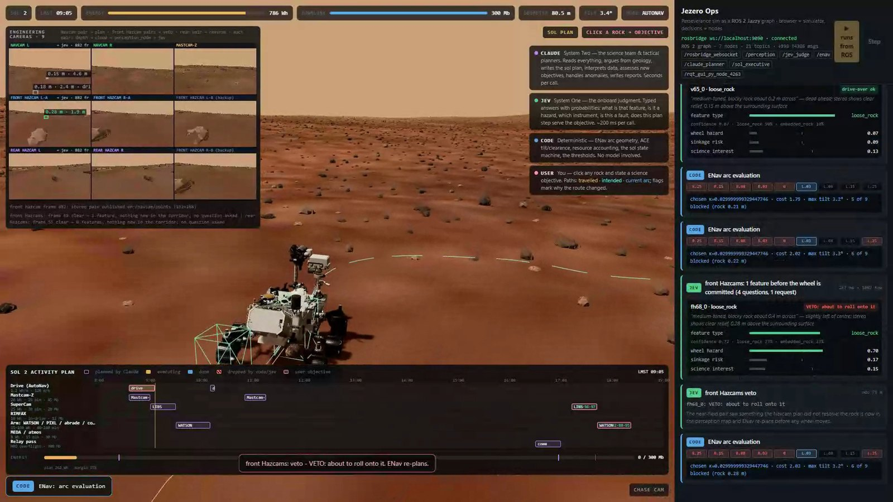

*A front-Hazcam veto. ENav had chosen an arc past a 0.28 m rock the Navcam plan did not resolve; before the wheels were committed the front Hazcam pair measured it at 1.9 m and jev answered "about to roll onto it" at P = 0.70. The console shows the ENav evaluations, the Hazcam card, the VETO entry, and ENav re-planning with the rock now in the perception map.*

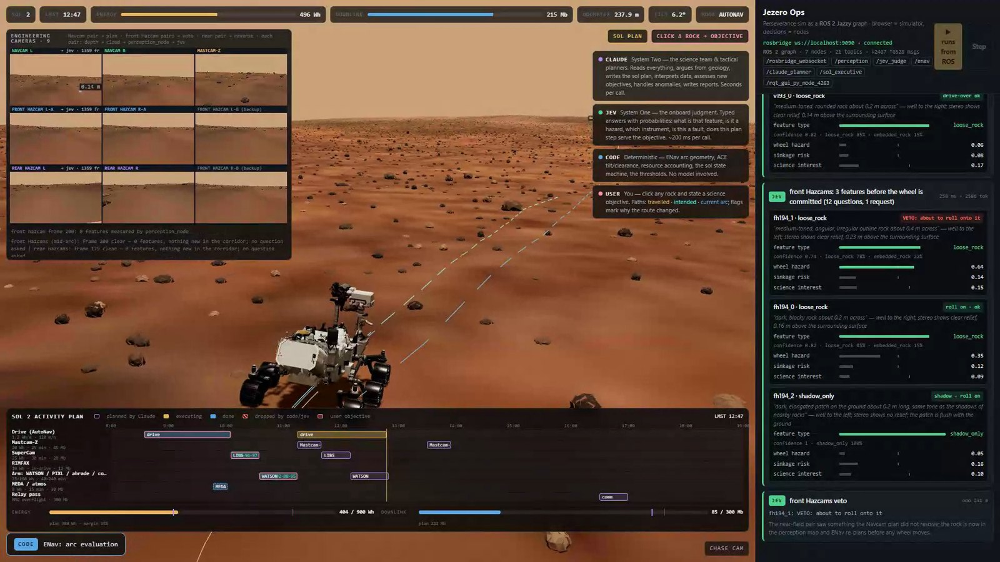

*The drive toward Rochette at 238 m. Intended route (dashed cyan) and current arc (blue) run ahead; the front-Hazcam status line reads "frame 200 clear — 0 features, nothing new in the corridor; no question asked". Right: a Hazcam card with three features before the wheel is committed — one vetoed at P = 0.64, one cleared, one a shadow.*

### 3.3a What a flight-like version needs: every camera, before every move

The demo perceives with one mast camera and a depth buffer. Perseverance carries nine engineering cameras: two **Navcams** on the mast (a stereo pair, ~96° × 73°, the planning horizon out to ~20 m), four **front Hazcams** (two stereo pairs, one redundant, ~136° × 102°, looking down at the ground the front wheels are about to roll onto and at the arm workspace), two **rear Hazcams** (~124° × 102°, for backing up), and the CacheCam — plus seven science cameras (Maki et al. 2020). Flight AutoNav thinks while driving: new stereo every few metres, the next arc planned before the current one ends, and no motion commanded that the near-field cameras have not cleared. A flight-like version of this architecture runs jev on **every camera group before every motion command**, and again several times while the arc executes:

| Camera group | Range / role | jev questions (per feature) | Code gate |
|---|---|---|---|
| Navcam pair (mast) | 3–20 m; plan the arc | feature type, wheel hazard, sinkage, science interest | perception map, keep-outs, confidence floor → re-image |
| Front Hazcam pairs | 0.3–4 m; ground under and just ahead of the front wheels, arm workspace | *about to roll onto it?* (Noul), *rock or shadow at wheel scale?* (Choice), *arm can deploy?* (Noul) | veto the next step if P(roll-over hazard) > 0.5; halt if unsure |
| Rear Hazcam pair | 0.3–4 m behind; reversing | same as front, mirrored | reverse arcs only from what the rear pair has cleared |

Cadence: before any motion command all three groups must have been cleared; during a 6 m arc the near-field pairs are re-asked every 0.5–1 m (all three groups in one request, ~300 ms), so a rock that was below the Navcam's stereo threshold at 8 m is caught by the front Hazcams at 1 m before a wheel reaches it. This is only affordable with a System One: a Hazcam check is a handful of features, three questions each, one request, cheaper than the stereo correlation that feeds it. An LLM in that seat would be a hundred times too slow and would not return a number a veto rule can read. In the ROS 2 port this is three perception nodes feeding one judge service, with the executive's motion command gated on all three having answered since the last odometry tick.

### 3.4 Science stops: vision belongs to the LLM

When the rover parks at a target, the Navcam frame goes to **Claude** — it reads the actual image and returns a field-geologist's description (tone, texture, coating, size relative to a wheel, other rocks in frame, hazards noticed). That description is appended to the target's state. Then **jev** does what AEGIS does on the real rover: it scores each visible candidate against the team's criteria (a Score on four levels) and picks the instrument (a Choice), and answers whether arm deployment is safe now. Code enforces the JPL ordering and the scheduler margin, runs the instruments, and hands the results back to Claude, which interprets them against the hypotheses and may amend the plan (Máaz: "basalt, supports H1, float — not a coring candidate; abrade for texture, hold the tube for Rochette").

### 3.5 Objectives from a human, verified by jev before they cost anything

Click any rock, type what you want checked. The loop is: **Claude** assesses (worth it? which instruments? what does it displace? inside the remaining Wh/Mb/minutes with margin) → **jev** verifies *every planned activity* with three probabilities (serves the objective / prerequisites met / risk acceptable now; floor 0.5) → **code** commits the survivors to the swimlane, drives, executes → **Claude** files a report: confirmed / refuted / inconclusive, evidence, cost, recommendation. In the recorded run the objective was a light-toned float rock; LIBS and WATSON came back olivine + carbonate; report: *Séítah-derived, confirmed (high)*. In an earlier take, on a dark float: *refuted — ordinary basalt; WATSON correctly withheld; Rochette budget untouched.*

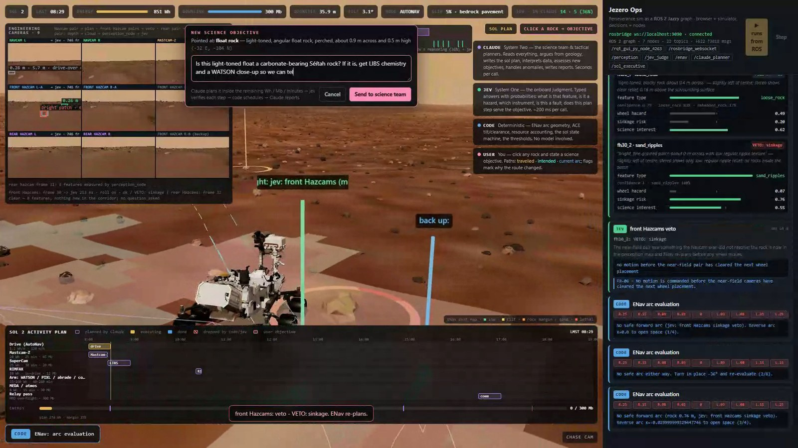

*Injecting an objective mid-drive, sol 2 (ROS 2 run). The user clicked a light-toned float 16 m ahead and types the question, which the browser publishes on `/ops/user_objective`. Behind the panel the rover is mid-manoeuvre: a front-Hazcam sinkage veto (`sand_ripples` 1.00, P(sinkage) = 0.76, FR-06) has just made ENav reverse and turn in place; the cost map and the Hazcam frusta are visible under the dialog.*

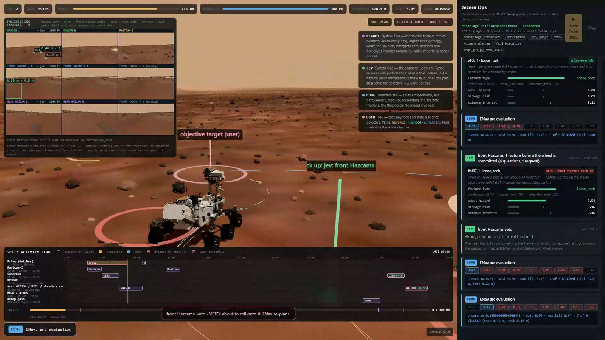

*The objective in the system: the picked rock flagged "objective target (user)", the approach drive under way, a front-Hazcam veto flag planted where a 0.4 m rock at P = 0.54 stopped a segment, and the swimlane carrying the objective's LIBS and WATSON blocks with jev's three verification probabilities.*

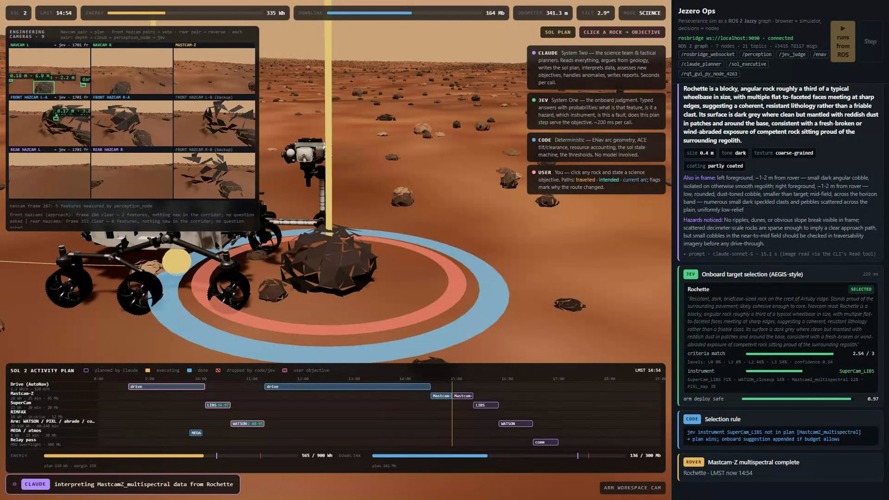

*The science stop at Rochette, sol 2. Claude read the Navcam frame through `/claude/describe` (blocky, angular, coherent, coarse-grained, partly coated; hazards: none); jev scored it against the criteria (2.54/3), picked SuperCam LIBS (71 %) and cleared the arm (0.97); code applied the selection rule.*

### 3.6 Faults: onboard halts, Earth decides

A scripted 46 % wheel-slip event is triaged by jev in one request: `fault_class` (Choice), `stop_drive` (Noul), `needs_ground` (Noul). Code halts immediately if `stop_drive > 0.5` — no Earth round trip needed for a halt — and escalates to Claude only if `needs_ground > 0.5` or the classification is under the confidence floor. Claude diagnoses and returns constraints the planners can encode (resume with visual odometry, back up and reroute, stop for the sol).

## 4. What each engine is trusted with, and why

- **Claude gets ambiguity, context, and language.** Plans, interpretations, images, objectives, reports. Its outputs are constrained by JSON schemas so code can consume them, but the *content* is open-ended reasoning. It is slow and it costs money; it runs a handful of times per sol.
- **jev gets closed questions with defined answers.** It never sees the whole game state — only the fields a question needs (context rot is real; the docs are blunt about it). Its answers are probabilities, so every threshold is a line of code we can inspect and tune, and its confidence is a first-class signal we route on.
- **Code gets everything that must be exact or must be the same every time.** Arithmetic, geometry, resource accounting, ordering rules, the margins, and the decision of *when to ask which model*. Neither model is ever asked "what should happen next?"

The three colours on screen are not decoration; they are the audit trail.

## 4a. System One inside System Two

The first two builds kept the two speeds apart: Claude planned at the cadence of a sol, jev judged at the cadence of a wheel, and code passed messages between them. That is the flight-operations picture, and it is right. But it hides the question this demo is meant to answer: **how much of the slow mind's reasoning can, and should, be fast judgment?** Ground planners lean on onboard tools — AEGIS scores, slip tables, keep-out maps — and the cheapest way to check a draft plan is to ask the same judge the rover will use.

So jev is now also a tool *inside* Claude's reasoning. The Claude CLI is launched with an MCP server (`tools/mcp_jev_server.mjs`) exposing one tool, `ask_jev(state, questions)`: the same TypeSafe call the rover makes, returned to the model as evidence mid-thought. The prompts tell Claude what a planner would do with it — score every candidate target against the draft criteria before committing, check an activity order against the sequencing rules, break a tie between two next actions, check whether an activity bears on a human's objective — and to treat the answers as evidence, not commands. Every consultation is captured from the CLI's event stream and returned to the executive (`consults_json`): the console shows it under the Claude card it belongs to, the HUD counts it, and the "two speeds of mind" strip draws it as a green tick inside the purple thinking block.

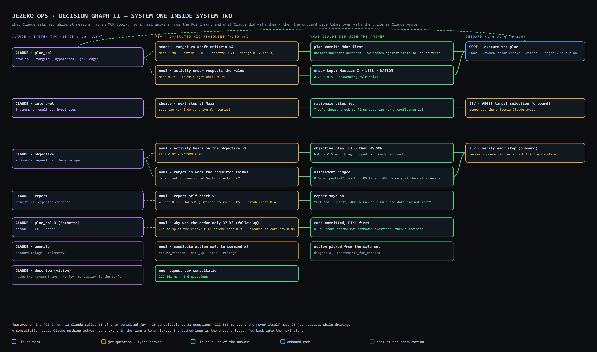

*Decision graph II. Planning sol 1, Claude scored all four targets against its own draft criteria (Máaz 2.98 of 3, Bastide 0.16) and checked its ordering (0.74); interpreting Máaz it asked one Choice to break a tie and cited the answer; assessing the user's objective it asked whether each activity bears on it (LIBS 0.92, WATSON 0.76) and whether the rock is what the requester thinks (0.62 — so it hedged); writing the report it asked jev to check its own conclusion and was told WATSON had not been justified by its own rule (0.05) — and said so. Planning sol 3 it got a low ordering score, asked *why* with two narrower questions, and committed the core with PIXL first.*

**How much is real time?** Measured on the recorded run: **18 Claude calls, 13 of which consulted jev — 13 consultations, 33 typed questions, 222–361 ms each.** The rover itself made 96 jev requests while driving (38 Navcam, 51 Hazcam, plus AEGIS, fault triage and verification). So about 12 % of all System One calls happen inside System Two's reasoning, and a consultation adds under half a second to a call that takes 15–95 s — jev answers in the time a token takes. The other direction is the **ledger**: at every uplink Claude is told what jev decided while driving (frames judged, obstacles and keep-outs added, vetoes, reads below the confidence floor, ground classes seen), so the slow mind plans on what the fast mind found.

**What it shows about the split.** Three things the consultations did that neither engine could do alone: *calibrated doubt on Claude's own draft* (jev scored Rochette 0.41 against sol-1 criteria written for Máaz, and the plan deferred it); *an honest audit of Claude's report* (asked whether its WATSON run was justified by the rule it had set — "only if the chemistry says so" — jev said 0.05, and the report says the run was not warranted); *decomposition under uncertainty* (a low ordering score became two narrower questions rather than a guess). None of this is jev reasoning — it cannot — and none of it is Claude judging its own calibration — it cannot. The boundary now runs *through* the LLM's chain of thought, and it is still drawn in code and visible on screen.

## 4b. What the port borrowed from JPL

- **Flight rules, cited.** Every gate names the rule it enforces (FR-01…FR-14: ops window, 15 % margin, tilt limit, step limit, keep-outs, near-field clearance before motion, reverse only on imaged ground, the confidence floor, arm-deploy conditions, sequencing, onboard halt vs. ground escalation, objective verification, the planned final bump, slip-budgeted driving) — modelled on how MER/MSL/M2020 planners work under enumerated flight rules; the numbers are this sim's.
- **Slip prediction by terrain class.** One more jev question per Navcam frame — what ground the wheels will roll on: bedrock pavement / cobble field / mixed regolith / sand drift — mapped by code to a predicted slip (5 / 12 / 20 / 45 %) that inflates the energy and time per metre, the way MSL/M2020 planners size a drive from slip-vs-terrain tables. Shown in the HUD.
- **A traversability cost map.** ENav publishes the hazard map it plans on (tilt, rocks in the perception map with a margin, keep-outs, sand; 0–100) and the simulator draws it over the terrain — the ACE/ENav picture rather than a black box.
- **The nine-camera cadence**, with each pair's field of view drawn when it is asked to image.
- **The onboard ledger** in the next uplink.

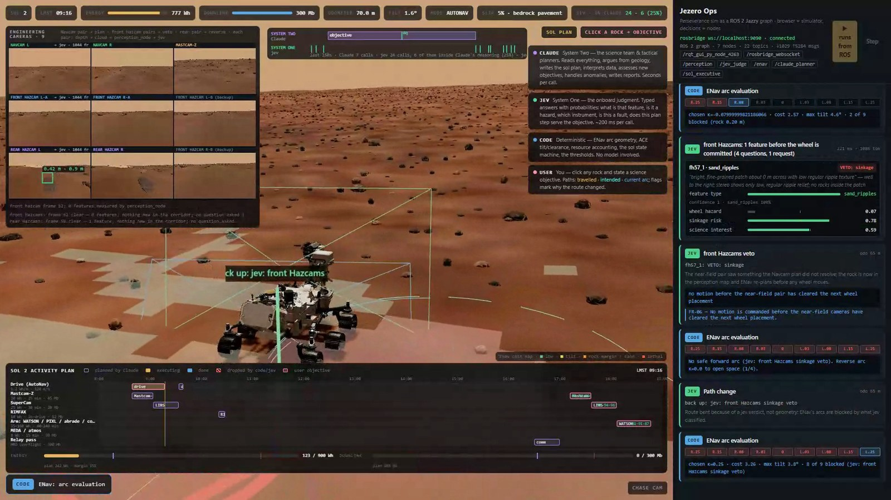

*ENav's cost map and a Hazcam veto, sol 2. The translucent cells are the traversability map ENav plans on (green low, yellow tilt, orange rock margin or sand, red lethal); the blue lines are the fields of view of the camera pairs just asked to image. The front Hazcams found a bright ripple patch under the next wheel placement; jev: `sand_ripples` at confidence 1.00, P(sinkage) = 0.79; the executive vetoed the segment citing FR-06 and ENav reversed. HUD: predicted slip 5 % on bedrock pavement; 24 jev calls so far, 6 inside Claude's reasoning; the strip shows the objective assessment in progress.*

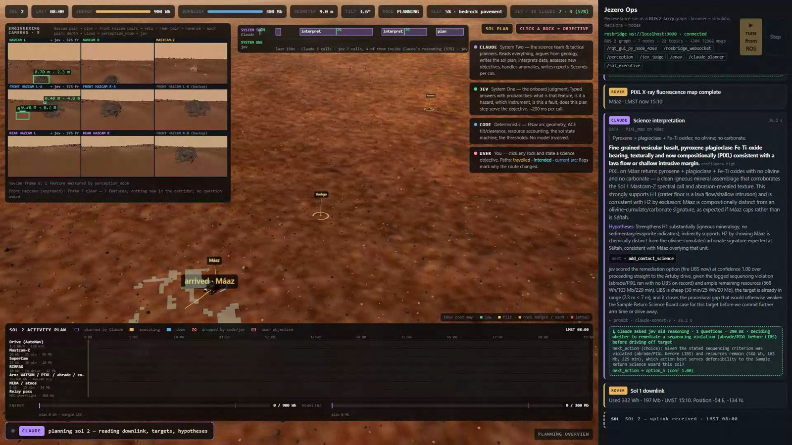

*The ROS 2 page during sol-2 planning. Top centre: the "two speeds of mind" strip — Claude's thinking intervals as purple blocks, jev's onboard calls as green ticks below, and the consultations Claude made inside its reasoning as green ticks inside the purple blocks. HUD: predicted slip for the ground ahead and the jev counters (calls · inside Claude). Right: Claude's PIXL interpretation card with the consultation beneath it — having noticed abrade and PIXL had run without a LIBS reading (a sequencing violation on its own record), it asked jev one Choice, *remediate now or drive off?*, got `option_A` at 1.00, and its rationale says so. HUD: 7 jev calls, 4 inside Claude (57 %). Top left: the ENav cost map.*

## 4c. Flight-like: actions, a behaviour tree, and jev on every stream

**Topics, services, actions.** Sensors and state are topics (`/rover/state` 10 Hz, `/rover/telemetry` 1 Hz, the camera clouds, the cost map, the console streams). Every jev judgment is a *service* — 200–500 ms, no intermediate state, never worth cancelling. Every Claude call is an *action* — 15–105 s, observable progress (phase, turns, jev consultations, elapsed, streamed to the "two speeds" strip) and cancellable: the executive holds the goal handle and withdraws it when the situation changes; the server kills the CLI and the question is re-asked against the current state. A judgment is a service; a behaviour is an action.

**The executive is a behaviour tree** (`py_trees`): a no-memory Selector whose first child is the safety condition and whose second is the mission Sequence — PlanSol, ReviewPlan, ExecuteSol, Downlink — each a leaf that runs in a thread and reports RUNNING. The tree ticks at 2 Hz, publishes to `/ops/tree`, and is drawn on the page. The safety branch *reports* a halt rather than preempting the mission: the halt and the anomaly action are handled inside the executing leaf, and a real preempt (our first version) cancelled the very action handling it and reset the sequence. The immediate halt does not wait for a tick either: stop verdicts are latched and the drive loop consumes them before every segment — the scripted slip lasts seven seconds, and an unlatched check missed it once.

**jev on the telemetry stream.** A `health_monitor` node turns the housekeeping stream — state of charge, battery temperature, highest actuator current, wheel slip, visual-odometry status, tilt, suspension differential, dust opacity — into words at 1 Hz and asks jev three questions whenever the words change or every 10 s while driving: what does this indicate (eight classes), should the drive stop, does the ground need to decide. P(stop) > 0.5 halts the next segment (FR-11); P(ground) > 0.5 starts the Claude anomaly action; a change of fault class while that action runs cancels it and re-issues it. The scripted slip event now arrives the way it would on a rover: as telemetry.

**jev everywhere else.** Before uplink, jev reviews every planned activity of the sol as a sequence review board would (serves the intent, in order, acceptable risk); failures are dropped and reported. Every Navcam frame is judged usable before the rover plans on it. Before any core, jev is asked whether the sample would be defensible to the Sample Return Science Board on the evidence in hand, whether the rock will core intact, and what is missing if not. At every relay pass, jev scores each data product's value if it comes down now, and code fills the pass by score minus an engineering reserve.

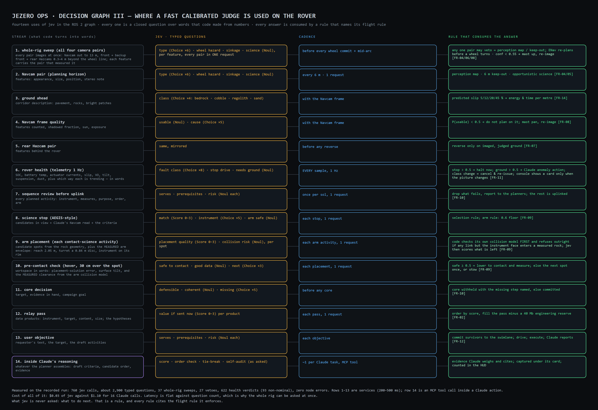

*Decision graph III: the fourteen places jev is used — stream in words, typed questions, cadence, and the rule with its flight rule. Rows 1–13 are services; row 14 is the MCP tool inside a Claude action. None asks jev what to do next.*

**The arm, placed by code, judged by jev.** Contact science used to be a two-joint gesture and a timer. The NASA model's arm is a real chain — shoulder azimuth and elevation, elbow, wrist, turret — and the simulator now drives it with a cyclic-coordinate-descent inverse-kinematics solver with joint limits, so the turret actually travels to the rendered rock. The placement decision is split the way the rest of the system is split. Code derives candidate spots from the rock's geometry — top facet, the face turned toward the rover, the two flanks — and describes each in words: attitude, reach against the workspace, light from the sun's position, dust, roughness, height. jev scores every spot for the instrument (a Score on four levels) and flags collision risk (a Noul), one request. Code takes the best acceptable spot, unstows, and brings the turret to a hover thirty centimetres over it, along the surface normal. From there the workspace is read back in words — the placement-solution error, the surface tilt under the instrument, the clearance — and jev is asked whether it is safe to lower to contact and whether the data will be good. Only then does the turret touch the rock; a no-go tries the next spot once, then stows. In the recorded run jev cleared the placements it was asked about (safe-to-contact 0.57 and 0.59 on the tilted tops of Máaz and the user's rock, answering "shift" each time; there was no other acceptable spot, so code proceeded and said so) and scored Rochette's flat top 2.99 of 3. In an earlier take it refused a steeply tilted top outright — safe-to-contact 0.26 — and the arm stowed with the reason on the console. Two more closed questions, two more rules citing FR-09, and the arm never moves on a judgment alone: the spot came from geometry, the motion from kinematics, and jev said yes or no at the two places a flight team would want a fast, calibrated opinion.

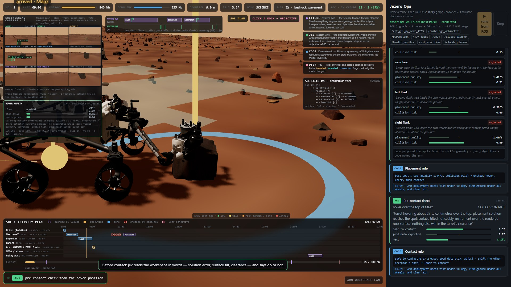

*Arm placement at a science stop (recorded run). The arm workspace camera: the turret has been brought over the spot jev chose and lowered to contact after the pre-contact check. Console: the placement card — four candidate spots with jev's quality score and collision risk, the chosen one marked — the placement rule citing FR-09, the pre-contact card and the contact rule. Markers on the rock: green chosen, grey acceptable, red rejected.*

**Real hardware.** `hardware-contract.md` maps every simulator interface to the standard ROS 2 interface a rover provides (odometry + tf2, BatteryState/Temperature/DiagnosticArray, `stereo_image_proc` clouds per pair, Nav2 FollowPath / ros2_control, FollowJointTrajectory for mast and arm) and what stays identical: perception, the jev services and health monitor, ENav, the executive, the Claude actions. Onboard, the TypeSafe endpoint becomes an onboard deployment behind the same service names; the ground actions stay on Earth with a real relay delay.

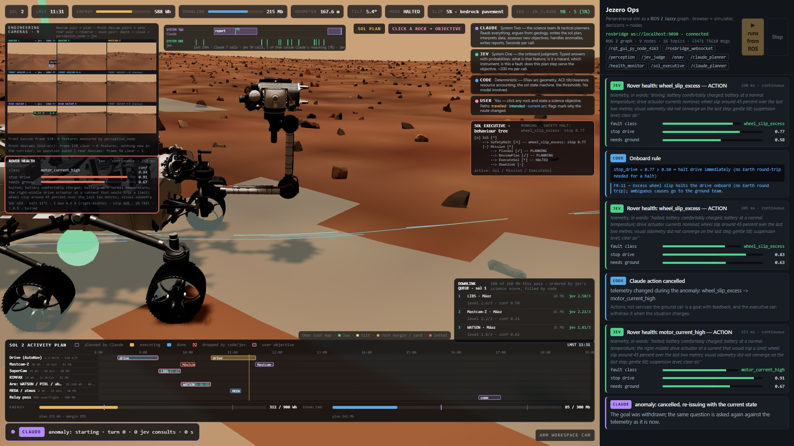

*The page during the sol-2 health halt (odometer 168 m, recorded run). Top right: the behaviour tree with the safety branch reporting the halt (wheel_slip_excess: stop 0.77) while ExecuteSol stays the active leaf; top centre: the strip as the re-issued Claude anomaly action starts. Left: the rover-health panel — jev's verdict has moved from wheel slip to motor_current_high (stop 0.91, ground 0.67), with the words it was shown and the raw housekeeping line (4.9 A on the right-middle actuator, slip 46 %, VO fail). Bottom right: the downlink queue from sol 1, ordered by jev and filled by code. Console: the health card that halted the drive, the onboard rule citing FR-11, the verdict while halted, "Claude action cancelled — telemetry changed during the anomaly: wheel_slip_excess → motor_current_high", and the re-issue. The overlays are sized so the rover stays visible in the middle.*

## 5. What we did today, in order

1. Verified the TypeSafe skill and API (all three primitives, 0.4 s), then built a small first game ("The Gate") to learn the shape: eleven parallel questions per turn, a code-owned decision path rendered live.
2. Pulled the official assets: USGS CTX DTM + orthomosaic (Fergason et al. 2020, doi:10.5066/P906QQT8), NASA/JPL Perseverance GLB; built the terrain with a real DEM and a Golombek rock field; split the wheels in Blender.
3. Built the sim: three.js world, ENav in code, jev question sets for hazards / AEGIS / faults, Claude prompts and schemas for planning / interpretation / anomalies, the ops console that shows every call's inputs and outputs.
4. Added, at your request: the swimlane sol plan with per-instrument power/time/data; click-a-rock objectives with jev verification and Claude reports; travelled / intended path lines with reason flags.
5. Fixed what the takes revealed: a mounting error that had the rover driving backwards; an ENav deadlock when jev's keep-outs surrounded the rover (escape logic + reversal); rocks being driven over (step limit + a wheel-track/belly footprint model instead of a circle); flag clutter (flags only for jev/ground/reversal decisions).
6. Replaced the rock-list "perception" with real perception: a rendered Navcam, depth-based blob measurement, sparse stereo in shadow, and Claude reading the frame at science stops.
7. Recorded the run (Playwright, 12 min), encoded with Blender's VSE, and uploaded to Drive by driving Chrome at the OS level after Chrome's own automation locks blocked every other route.
8. Moved the whole graph onto ROS 2 Jazzy in a fresh WSL 2 distro: `jezero_msgs` (22 messages, 7 services), five nodes, the browser reduced to a simulator on rosbridge; a full three-sol run with the objective injection completed with no node errors.
9. Added the nine-camera engineering rig and the flight-like check cadence: every stereo pair produces its own cloud, front Hazcams asked before every segment and mid-arc, rear pair before any reverse; reversing no longer reads the world's rock list.
10. Re-recorded the run on ROS 2, replaced every screenshot with one from that run, and wrote this report and the vision paper in Markdown and LaTeX with PDFs.
13. Fifth pass: the robotic arm became a real kinematic chain driven by inverse kinematics; jev scores the candidate placement spots code derives from the rock geometry and clears contact from the hover position; photogrammetry rocks; re-recorded and rewritten.
12. Fourth pass: Claude calls became ROS 2 actions with feedback and cancel; the executive became a py_trees behaviour tree with a safety branch; a health-monitor node runs jev on the 1 Hz telemetry stream; jev added to sequence review, frame usability, sample defensibility and downlink prioritisation; a hardware contract for every interface; re-recorded and rewritten.
11. Third pass: gave Claude jev as an MCP tool while it reasons, captured every consultation and measured how much System One runs inside System Two; added flight-rule citations on every gate, slip prediction by terrain class, the ENav cost map, camera frusta and the two-speeds strip; drew Decision Graph II; re-recorded and rewrote the papers and the ROS 2 notes.

## ROS 2

The same graph now runs as a ROS 2 Jazzy system (Ubuntu 24.04 under WSL 2). The browser keeps only what a simulator owns — terrain, the rover's motion, the camera rig, rendering, the HUD — and talks to the graph over rosbridge; perception, jev judgment, ENav, the LLM planner and the sol executive are nodes with typed interfaces (`jezero_msgs`: 22 messages, 7 services). Every decision is a `Decision` message carrying its engine, so a bag replays the attribution stream. A full three-sol run — plans, the perception loop, science stops with Claude reading the Navcam frame, a user objective verified by jev and reported by Claude — completed over the graph with no node errors and is recorded as `jezero-ops-ros2-v2-1080p.mp4`.

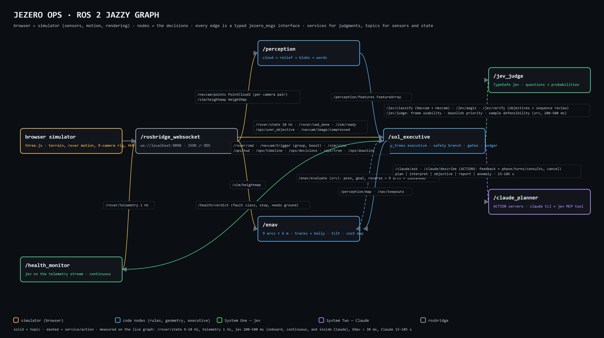

*The live ROS 2 graph. Gold: the browser simulator. Blue: code nodes — perception, ENav, the sol executive. Green: jev behind four services. Purple: Claude behind two. Solid = topics, dashed = services; measured: `/rover/state` 9–10 Hz, jev 200–300 ms, ENav < 30 ms, Claude 15–80 s.*

The port is also where the camera section above became real: the simulator renders the nine engineering cameras, each stereo pair produces its own point cloud, and the executive's drive loop asks jev about the Navcam pair every 6 m, the front Hazcam pair before every 3 m segment and again mid-arc, and the rear pair before any reverse. jev is asked only about features that are new, inside the wheel corridor, and not already cleared by geometry; a *veto* puts the rock into the perception map and ENav re-plans before a wheel moves. Recorded three-sol run (24 min): 314 front-Hazcam and 28 rear-Hazcam frames reduced to 51 near-field jev calls and 36 vetoes, on top of 56 Navcam cycles, 203 forward + 35 reverse ENav evaluations, 18 Claude calls ($2.01), no node errors. Reversing no longer reads the world's rock list — the rear Hazcams see for themselves. See `ros2-migration.md` for the node table, the run recipe and what is still a simulator shortcut.

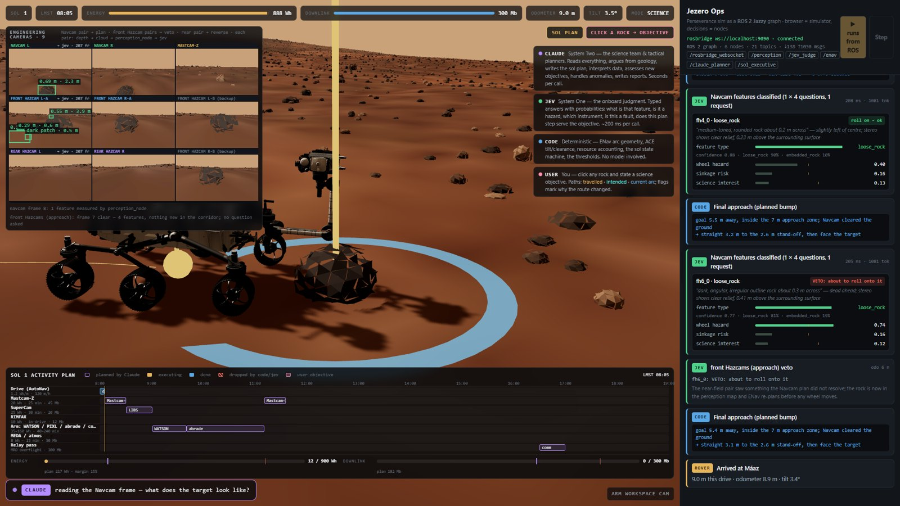

*The ROS 2 page at the sol-1 science stop. Top left: the 3×3 rig — Navcam L/R + Mastcam-Z, front Hazcam pairs A/B, rear Hazcam L/R — with perception's boxes on each pair's primary camera and a status line per group. Top right: the live graph panel. Console: a front-Hazcam jev card that vetoed the approach (P = 0.74), the executive's planned bump to the stand-off, and arrival.*

## 5a. Measuring instead of asserting

Every earlier pass of this report described what the system *does*. This one describes what it *achieves*, because the qualitative claims turned out to be hiding two real defects. Each number below comes from a tool in `tools/` that scores the system against the world's rock list — ground truth the rover itself never reads.

### 5a.1 Perception: a shadow model that ate its own boulders

Stereo fails in deep shadow, and the pipeline modelled that by discarding shadowed pixels at random. Randomly deleting 65 % of a region's pixels destroys 4-connectivity: a shadowed boulder came apart into single-pixel fragments, every one of them under the blob floor, and the only thing left that still joined up was the flat dark skirt around its base. The rock was therefore reported as `dark_patch` — *a shadow*. For a driver that is the worst available error, and it was invisible because every individual stage looked correct.

Real stereo does not fail pixel by pixel. A correlation window either finds a match or it does not, and neighbouring windows fail together. Dropout is now applied on a 4×4 block hash; components are 8-connected; and thresholding is hysteresis, seeding on relief above 0.075 m and growing into relief above 0.028 m so the box is the rock's whole footprint rather than its crown. Perception renders at 384×216 rather than 192×108.

| | before | after |
|---|---|---|
| recall, all rocks ≥ 0.35 m (`perception_eval`) | 3.6 % | **13.9 %** |
| recall, 0.5–0.8 m | 8 % | **20 %** |
| recall, 0.8–1.2 m | 33 % | **56 %** |
| the ten largest rocks at 4 m stand-off (`recall_probe`) | 3/8 | **8/8** |
| median size error | 57 % | **47 %** |

The remaining gap is range, not logic. `traverse_eval` walks a forced straight line with ENav switched off and counts rocks above the 0.20 m step limit that end up under a wheel: six in 60 m, of which the perception map held two and had never seen the other four. So the rover drives over roughly ten step-limit rocks per 100 m, and most of those it never saw. That is a perception budget problem — a denser stereo pipeline and a higher imaging cadence — not a property of the decision graph.

### 5a.2 The arm: a turret seven times bigger than its collision model

The second defect was visible in a single frame: the turret buried inside a boulder while the console reported clearance. The collision model approximated the turret as a capsule of radius 0.12 m. Measured off the model (`arm_metrics`), the turret is a disc **0.83 × 0.34 × 0.84 m**, and the instrument sits on its *rim*, 0.37 m from the turret's own pivot. The model was wrong by a factor of seven in the one dimension that mattered.

Nothing is approximated now. Points are sampled off the turret's real meshes and transformed by the live pose; the long links stay capsules, which they genuinely are; and only geometry within 0.10 m of the instrument face is allowed inside a rock, because that is the part whose job is to touch. Rocks became ellipsoids sized to the measured footprint and relief — a sphere sized to a wide flat slab's footprint stands a metre taller than the slab does, and that phantom height was rejecting exactly the placement a rover wants, the instrument flat on the top facet.

That done, the stand-off distance turned out to be wrong too, and the measurement said so:

| stand-off | placements accepted | top-facet placements | accepted but penetrating |
|---|---|---|---|
| 1.2 m | 1/24 | 1/10 | 0 |
| **1.6 m** | **20/30** | **10/10** | **0** |
| 2.0 m | 9/30 | 1/10 | 0 |
| 2.3 m (the old value) | 10/30 | 0/10 | 0 |

At 2.3 m the arm has to stretch out nearly flat over the rock to reach its top, and the forearm grazes it; at 1.2 m the rock is under the front wheels and inside the folded arm. FR-13 now commands a 1.6 m stand-off, derived from the measured envelope rather than chosen. Across every configuration the number of accepted placements that penetrate the rock is zero — and about two thirds of candidate spots are now refused, which is the honest consequence of a turret that wide.

The measured envelope is also given to jev, in `arm_envelope`: how far the arm reaches, how big the turret is, and that only the instrument face may touch. Before that, jev was scoring placements without knowing the size of the thing it was placing.

### 5a.3 What the cameras can see, drawn on the ground

Each camera's depth frame is splatted into a world-space coverage map. The occlusion is exact by construction rather than by a shadow test, because the splat *is* what the depth buffer recorded: the ground behind a rock was never measured, so it is never marked. `coverage_eval` parks the rover 7 m from each of the ten largest rocks in the area and samples the map inside the geometric shadow and beside it at the same range: mean coverage behind a rock **0.10**, beside it **0.87**, nine of ten casting a proper shadow.

One instructive failure along the way: an early version stretched each splat along the view ray to hide striping in the far field. A splat from a rock's *top* surface then spilled past the rock and painted the ground behind it, filling in the occlusion shadow the map exists to show. The striping is the honest artefact; the smoothing was the lie.

### 5a.4 jev at a cadence an LLM could not reach

Two changes exploit what System One costs. Before any wheel is committed, and again mid-arc, **every camera pair images and everything new in the corridor goes to jev in one request** — one veto from any pair stops the move. And jev now reads **every telemetry sample**, roughly one a second, with trend terms so a channel on its way somewhere is caught before it trips a limit.

The recorded run: 37 whole-rig sweeps, 27 vetoes, 622 health verdicts of which 93 non-nominal, 760 jev calls and about 2,900 typed questions in total. Measured cost: **$0.03 of jev** against **$1.10 of Claude**, which is the whole argument in two numbers. Latency is flat against question count — a request carrying 48 questions returns in the same ~250 ms as one carrying 4 — so batching the whole rig costs nothing in time either.

A caution that came out of this: the framing of a question moves the answer. When the sweep described a feature nine metres away as "under the next wheel placement", jev's confidence fell to 0.28–0.56 and the 0.55 gate halted the rover on nearly every sweep. The words a System One model is given have to match the measurement; a state that quietly misdescribes the world produces a model that is correctly uncertain about a question nobody meant to ask.

### 5a.5 A twenty-minute run as a two-minute video

Roughly two thirds of a run's wall clock is Claude reasoning with nothing moving. The CLI itself adds only about 1.2 s per call, and jev about 250 ms, so there is no idle time to remove — the model is genuinely thinking. The run is therefore not made shorter; the recording is re-timed. A speed plan derived from the run's own event log keeps the moments where a decision changes something at real time and compresses the rest, with the multiplier burned into the corner throughout. The recorded run: 1,333 s of wall clock, 120 s of video, 14 real-time windows.

## 6. Honest limits

This is a demonstration. It is not flight software, it has not been validated against rover data, and the numbers above describe a simulator scoring itself against its own ground truth.

- **Small rocks are missed and driven over**: 7 % recall at 0.35–0.5 m, 20 % at 0.5–0.8 m, and about ten step-limit rocks per 100 m ending up under a wheel, most of them never perceived.
- **Two thirds of arm placements are refused** because the turret is 0.84 m across and reaches 2.05 m. The refusals are correct; the workspace is simply small.
- The arm's collision model is sampled points and capsules against ellipsoids. Much better than a guess, and still not the real turret mesh against the real rock mesh.
- The back-up-and-drive-around manoeuvre exists and fires when every forward arc is blocked, but it is rare enough in a recorded run to be easy to miss. The demo does not showcase it well.
- The instruments return one-paragraph "pipeline summaries" from a truth table, not spectra.
- The dust devil and the slip event are scripted so they reliably appear in a short run; sand, rocks and shadows are perceived.
- Perception uses the renderer's depth buffer as a stereo stand-in, with deliberate patch-wise dropout in shadow; real stereo is noisier everywhere.
- jev's calibration is taken from its documentation and our own spot checks; nothing here was validated on rover data.
- Claude's tactical plans are good geology but occasionally over-plan a sol; the scheduler drops what does not fit.

None of these is a limit of the architecture. They are a perception pipeline that needs to be denser, a turret that needs a real collision mesh, and a demo that needs more takes.

## 7. Sources

- USGS Astrogeology, *Mars 2020 Terrain Relative Navigation CTX DTM & Orthomosaic*, Fergason et al. 2020, doi:10.5066/P906QQT8.
- NASA/JPL-Caltech, *Mars Perseverance Rover 3D model*, science.nasa.gov.
- JPL, "NASA's Self-Driving Perseverance Mars Rover 'Takes the Wheel'" (AutoNav, ~120 m/h); Ono et al., ENav / ACE (arXiv:2011.06022); JPL AI Group, "Onboard Planning for the Mars 2020 Perseverance Rover" (ASTRA 2022).
- Golombek et al., rock size-frequency distributions for Mars landing sites.
- Poly Haven (polyhaven.com), CC0 photogrammetry rock scans: moon_rock_01–07, namaqualand_boulder_02/03/05/06, namaqualand_stones_01, rock_09, stone_01 (prepared by `tools/fetch_rocks.py` and `tools/prep_rocks.py` in Blender).
- TypeSafe documentation: *How to build with TypeSafe*, *Primitives*, *Confidence*, *Jev 1.13 jaggedness*.
