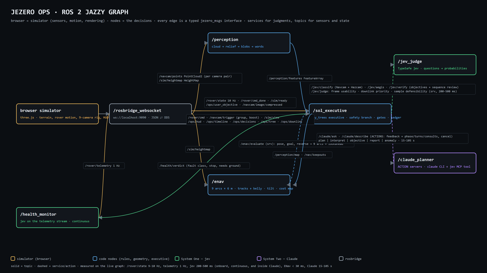

# Jezero Ops on ROS 2 — the port, and what it proved

> v4 (19 Sep): Claude calls are **actions** (feedback + cancel), the executive is a **py_trees behaviour tree** with a safety branch, jev runs **continuously on the telemetry stream** and is used everywhere a real rover would use a fast calibrated judge: hazards, near-field vetoes, terrain class, target selection, arm safety, sequence review before uplink, frame usability, health, sample defensibility, downlink prioritisation, objective verification — and inside Claude's reasoning. `docs/hardware-contract.md` says what a real rover plugs into each interface.

**Status (18 Sep 2026): working.** The whole decision graph runs as a ROS 2 Jazzy system inside
WSL 2 (Ubuntu 24.04), with the browser reduced to a simulator on a rosbridge socket. A full
three-sol run — Claude's sol plans, the Navcam/Hazcam perception loop, jev's typed judgments,
ENav, the science stops with Claude reading the Navcam frame, a user-injected objective verified
by jev and reported by Claude — completed over the graph with zero node errors. The recording is
`out/jezero-ops-ros2-v2-1080p.mp4` (Drive folder, same name; the earlier `jezero-ops-ros2-1080p.mp4` is the pre-goal-2 take).



## 1. Shape of the port

The rule that made the sim legible — *code owns the workflow; a model answers narrow typed
questions* — turned out to be exactly the rule that makes a ROS 2 graph clean. Every boundary that
was a JSON message in the browser is now a typed interface in `jezero_msgs` (22 messages, 7
services). The browser kept only what a simulator owns: terrain, rover motion, the camera rig,
rendering, the HUD. Nothing in the browser decides anything any more.

| Node | Engine | Owns | Interfaces |
|---|---|---|---|
| `browser simulator` (three.js, roslibjs) | sim | terrain, rover pose and motion, 9 engineering cameras, Navcam PNG, HUD/console rendering | pub `/rover/state` (10 Hz), `/sim/heightmap` (1 Hz local DEM), `/navcam/points` (PointCloud2 per capture), `/navcam/image/compressed`, `/rover/cmd_done`, `/ops/user_objective`, `/sim/ready`; sub `/rover/cmd`, `/navcam/trigger`, `/sim/view`, `/ops/*` |
| `/perception` | code | organized cloud → relief above the local DEM → connected blobs → measured numbers → words; shadow dropout unless the capture was a mast-raised second pair; per-group windows (Navcam 1.9–13 m ahead; Hazcams 0.3–4 m beyond the wheel line) | sub `/navcam/points`, `/sim/heightmap`, `/navcam/trigger`; pub `/perception/features` (`FeatureArray`, with `group`) |
| `/jev_judge` | System One | the four question sets (Navcam hazards, Hazcam near-field, AEGIS-style target selection, fault triage, plan verification); the TypeSafe key | srv `/jev/classify`, `/jev/aegis`, `/jev/fault`, `/jev/verify` (200–300 ms) |
| `/enav` | code | nine arcs × 6 m, wheel-track + belly footprint against the perception map, jev keep-outs, tilt from the local height map, lookahead; a 29×29 m traversability cost map per evaluation | srv `/enav/evaluate`; sub `/perception/map`, `/nav/keepouts`, `/sim/heightmap`; pub `/nav/costmap` |
| `/claude_planner` | System Two | prompts, schemas, the `claude` CLI (a Windows binary launched through WSL interop; prompt on stdin, Navcam PNG written to a Windows path) in `stream-json` mode with **jev as an MCP tool** (`tools/mcp_jev_server.mjs`); every `ask_jev` tool call is captured from the event stream | srv `/claude/ask` (plan / interpret / objective / report / anomaly) → output + `consults_json` + turns; `/claude/describe` (15–95 s) |
| `/sol_executive` | code | the sol state machine: plan → execute → drive → classify → science → objective → downlink; every gate and threshold, each citing its flight rule (FR-01…14); slip-budgeted driving from jev's terrain class; the perception map and keep-outs; the onboard ledger handed to Claude at uplink; the swimlane; attribution and the jev/Claude counters | pub `/ops/decisions` (`Decision`: engine, kind, title, payload), `/ops/hud`, `/ops/timeline`, `/sim/view`, `/rover/cmd`, `/navcam/trigger`, `/perception/map`, `/nav/keepouts`, `/ops/world` |
| `/rosbridge_websocket`, `/rosapi` | — | JSON ⇄ DDS for the browser; the browser's live "N nodes · M topics" panel | ws://localhost:9090 |

## 1a. Topics, services, actions — which is which, and why

| Kind | Used for | Interfaces |
|---|---|---|
| **Topics** | streams and fire-and-forget commands | `/rover/state` 10 Hz, `/rover/telemetry` 1 Hz, `/sim/heightmap`, `/navcam/points`, `/navcam/image/compressed`, `/navcam/trigger`, `/perception/features`, `/perception/map`, `/nav/keepouts`, `/nav/costmap`, `/health/verdict`, `/rover/cmd` → `/rover/cmd_done`, `/sim/view`, `/ops/decisions`, `/ops/hud`, `/ops/timeline`, `/ops/tree`, `/ops/downlink`, `/ops/world`, `/ops/user_objective`, `/sim/ready` |
| **Services** | every jev judgment and the ENav query: 200–500 ms, no useful intermediate state, never worth cancelling | `/jev/classify`, `/jev/aegis`, `/jev/fault`, `/jev/verify`, `/jev/judge` (frame · downlink · sample · health), `/enav/evaluate` |
| **Actions** | the ground calls: 15–105 s, observable progress, must be cancellable | `/claude/ask` (plan · interpret · anomaly · objective · report; feedback = phase, turns, jev consultations, elapsed; result = the schema output + `consults_json`), `/claude/describe` (Navcam frame) |

The rule of thumb is the same one flight software uses: a *judgment* is a service, a *behaviour* is an action. The executive keeps the goal handle of any running Claude action and withdraws it when the health monitor's verdict changes class during a halt (`cancel_goal_async`); the action server kills the CLI subprocess and returns `cancelled`; the executive re-issues the same question once against the current telemetry. jev-inside-Claude is not a ROS interface: it is an MCP tool inside the `claude` process and comes back in the action result.

## 1b. The executive as a behaviour tree

```
Sol (Selector, no memory)          re-evaluated every tick (2 Hz), safety first
├── SafetyHalt (condition)         reports a health-triggered halt (feedback, /ops/tree.safety_halt); never preempts
└── Mission (Sequence, memory)
    ├── PlanSol      Claude action + jev consultations
    ├── ReviewPlan   jev verifies every planned activity before uplink (sequence review)
    ├── ExecuteSol   drive / classify / science / objective (resumable)
    └── Downlink     jev prioritises the data products; code fills the pass
```
`py_trees` leaves run their work in a thread and report RUNNING; the tree state is published on `/ops/tree` and drawn on the page. The immediate halt does not wait for a tick: the drive loop checks the latest `/health/verdict` before every segment (FR-11), then the tree shows the safety branch active while the anomaly is handled and the mission branch resumes where it was. A leaf that fails (a ground-call timeout) fails the sol once and the sol is re-run from planning.

## 1c. Where jev is used — the complete list

| # | Where | Question type | Rate | What code does with the answer |
|---|---|---|---|---|
| 1 | Navcam features (planning horizon) | Choice type · Noul wheel hazard · Noul sinkage · Noul science | every 6 m | perception map, 6 m keep-outs, opportunistic science, confidence floor → re-image |
| 2 | ground class ahead | Choice (bedrock · cobble · regolith · sand) | with 1 | predicted slip → energy/time per metre (FR-14) |
| 3 | frame usability | Noul usable · Choice cause | with 1 | FR-08: do not plan on a bad frame; mast pan, re-image |
| 4 | front Hazcam pairs (near field) | same four, wheel-scale | before every 3 m segment and mid-arc | veto → perception map / keep-out, ENav re-plans (FR-06) |
| 5 | rear Hazcam pair | same, mirrored | before any reverse | FR-07 |
| 6 | **rover health** (telemetry stream) | Choice fault class · Noul stop · Noul needs ground | 1 Hz sampled, asked on change or every 10 s while driving | halt (FR-11), escalate to the ground action, cancel/re-issue on class change |
| 7 | sequence review before uplink | Noul serves · Noul order · Noul risk, per planned activity | once per sol | drop what fails, report to the planners (FR-10) |
| 8 | AEGIS-style target selection | Score match · Choice instrument · Noul arm safe | each science stop | selection rule, arm rule (FR-09) |
| 9 | **arm placement** (each contact-science activity) | Score placement quality · Noul collision risk, per candidate spot (top, near face, flanks — proposed by code from the rock geometry) | each arm activity | best acceptable spot, else no contact science; code unstows and moves the arm with IK (FR-09) |
| 10 | **pre-contact check** (hover 30 cm over the spot) | Noul safe to contact · Noul good data · Choice next | each placement | lower to contact and measure, or try the next spot once, or stow (FR-09) |
| 11 | sample defensibility | Noul defensible · Choice missing · Noul coherent | before any core | core withheld with the missing step named (FR-10) |
| 12 | downlink prioritisation | Score per data product | each relay pass | order by score, fill the pass minus the engineering reserve (FR-02) |
| 13 | user objective verification | Noul serves · order · risk, per activity | each objective | commit survivors to the swimlane (FR-12) |
| 14 | inside Claude's reasoning | whatever the planner asks (score, order, tie-break, self-audit) | ~1 per Claude task | evidence Claude weighs; captured and shown |

Everything on this list is a closed question over words that code made from numbers; nothing on it asks jev what to do next.

## 2. Every camera, before every move

The port added what the report's camera section asked for. The browser renders Perseverance's
engineering-camera rig — Navcam L/R and Mastcam-Z on the mast, front Hazcam pairs A and B, rear
Hazcam L/R — as a 3×3 grid, and each stereo *pair* produces its own point cloud (from the left
camera's depth buffer, standing in for stereo correlation; the right camera and the backup pair
are display only). The executive's drive loop then runs:

1. **Navcam pair every 6 m** → perception → jev (4 questions per feature) → perception map,
   keep-outs, confidence gate → ENav plans the arc.
2. **Front Hazcam pair before every 3 m segment and again mid-arc** → perception in the near-field
   window → jev is asked only about features that are *new*, *inside the wheel corridor* and *not
   already cleared by geometry* (measured relief ≥ 0.15 m, or relief unknown): *about to roll onto
   it?* (Noul), *rock or shadow at wheel scale?* (Choice), *sinkage?* (Noul). `P(roll-over) > 0.5`
   or `P(sinkage) > 0.5` → **veto**: the rock enters the perception map (or a 3 m keep-out) and
   ENav re-plans before any wheel moves; confidence below 0.55 → halt and re-image.
3. **Rear Hazcam pair before any reverse** (ENav's escape arcs and the anomaly back-up) — which
   also removed the last "truth" shortcut: reversing used to read the world's rock list.
4. **Final approach**: inside 7 m the target rock itself sits in the perception map and would veto
   every arc into the stand-off, so code commands a straight bump to the 2.6 m stand-off, with a
   Hazcam check that excludes the target.

The recorded three-sol run (24 min, `ros2/stats.sh`, `docs/ros2/stats-final.txt`): 56 Navcam frames,
314 front-Hazcam frames, 28 rear-Hazcam frames; 38 Navcam and 51 Hazcam jev calls; 36 vetoes; 203
forward and 35 reverse ENav evaluations; 5 AEGIS, 1 fault-triage and 1 plan-verification call; 18
Claude calls ($2.01), 13 of them consulting jev mid-reasoning (13 consultations, 33 questions); 0
errors. Most Hazcam frames cost nothing: no new feature in the corridor → no question asked — 342
frames became 51 questions.

## 2a. System One inside System Two

`claude_planner_node` launches the CLI with `--mcp-config tools/mcp-jev.json --allowedTools mcp__jev__ask_jev --output-format stream-json`. The MCP server is a 60-line Node stdio process that forwards `ask_jev(state, questions, note)` to the TypeSafe API and logs each call (`out/mcp_jev.log`). The node parses the stream for `tool_use`/`tool_result` pairs and returns them as `consults_json`; the executive counts them (`Hud.jev_in_claude`), publishes them under the Claude card (`Decision.payload_json.consults`) and emits `mind` view commands so the browser's strip can draw Claude's thinking interval with the consultations inside it. On the recorded run: 18 Claude calls, 13 with consultations, 13 consultations, 33 questions, 222–361 ms; 96 onboard jev requests. `ros2/stats.sh` prints all of it from the launch log.

Other goal-2 additions: `FLIGHT_RULES` and `SLIP_BY_CLASS` in `world.py`; a `ground__class` Choice added to every Navcam classification (`questions.hazard_questions(..., ground_words)`), mapped to predicted slip and shown in the HUD; `CostMap` on `/nav/costmap` from ENav, drawn by `view.costmap()`; camera frusta drawn on capture; `Hud` carries `slip_pct`, `ground_class`, `jev_calls`, `jev_in_claude`, `claude_calls`.

## 3. Running it

```
# once: provision ROS 2 Jazzy in the WSL distro (Ubuntu 24.04, imported from the Canonical rootfs)
wsl -d ros2 -u root -- bash /mnt/c/<path-to-repo>/ros2/setup_wsl.sh
# build: jezero_msgs (copied) + jezero_ops (symlinked to the repo, --symlink-install)
wsl -d ros2 -u root -- bash -lc 'cd /root/ws && colcon build'
# run the graph (rosbridge + 5 nodes), detached, log in /root/launch.log
wsl -d ros2 -u root -- bash /mnt/c/<path-to-repo>/ros2/start_graph.sh
# serve the browser simulator on Windows and open the ROS page
npm start        # http://localhost:4180/ros.html   (autoplay starts when the sim reports ready)
# recorded run with the simulated user (objective injected on the sol-2 drive)
node tools/autorun_ros.mjs shots/ros3 --record out/jezero-ops-ros2-1080p.webm
# what the graph did
wsl -d ros2 -u root -- bash /mnt/c/<path-to-repo>/ros2/stats.sh
```

`ros2/jezero_ops/config/policy.yaml` holds the thresholds (tilt 20°, step 0.20 m, confidence floor
0.55, verify floor 0.5, energy margin 15 %, keep-out 6 m). `docs/ros2/graph-evidence.txt` is a
capture of `ros2 node list`, `ros2 topic list`, `ros2 topic hz /rover/state` (9–10 Hz) and one
`/ops/decisions` message from the live graph.

## 3a. Real hardware

`docs/hardware-contract.md` maps every simulator interface to the standard ROS 2 interface a rover
would provide (`nav_msgs/Odometry` + `tf2`, `sensor_msgs/BatteryState`/`Temperature`/`DiagnosticArray`,
`stereo_image_proc` clouds per camera pair, `nav2 FollowPath` / `ros2_control` for the drive,
`FollowJointTrajectory`/MoveIt for mast and arm) and lists what stays identical: perception, the jev
services and the health monitor (they read words code makes from those streams), ENav, the executive,
the Claude actions. On a rover the TypeSafe endpoint is replaced by an onboard deployment behind the
same service names; the ground actions stay on Earth with a real relay delay.

## 4. What is still a simulator shortcut

- Stereo is the renderer's depth buffer with deliberate dropout in shadow, not correlation;
  `stereo_image_proc` on a real Navcam pair would slot in at `/navcam/points` unchanged.
- The local height map ENav uses for tilt comes from the DEM the simulator holds (the rover would
  build it from stereo). Rocks never come from the DEM — only from the cameras.
- Instrument results are one-paragraph summaries from a truth table in `world.py`.
- The arm is kinematically real (the NASA model's chain, CCD inverse kinematics with joint limits) but has no collision
  model: the placement-spot words come from the rock's geometry and the sun, not from imaging the workspace, and the
  pre-contact check reads the IK error and the rendered surface tilt rather than a contact sensor.
- Claude and jev are network calls. On a rover jev's latency class is onboard-plausible; Claude is
  the ground segment and its 15–80 s is a relay pass, not a control loop.
- Windows `claude.exe` is invoked through WSL interop; `WSLENV` forwards `CLAUDECODE=` so the
  headless CLI does not think it is nested.

## 5. Next steps toward "official"

| Milestone | Effort |
|---|---|
| Gazebo world from the USGS DEM + rock field; Perseverance URDF with rocker-bogie joints; real stereo cameras (`stereo_image_proc`) | 3–5 days |
| ~~Executive as a `py_trees` behaviour tree; model calls as actions with feedback~~ — done in v4 | — |
| Arm on MoveIt 2 with a collision scene from the perception map; WATSON workspace imaging feeding the placement words | 2–3 days |
| Foxglove panels driven by `/ops/decisions` and `/ops/timeline` (replaces the browser console) | 1 day |
| Nav2: ENav as a controller plugin, jev keep-outs as a costmap layer | 2–3 days |
| Space ROS build (Humble), static analysis, requirements traceability | 1–2 days |
| `rosbag2` of a full run as the deliverable ("why did it turn left at 48 m?" = a bag query) | hours |
